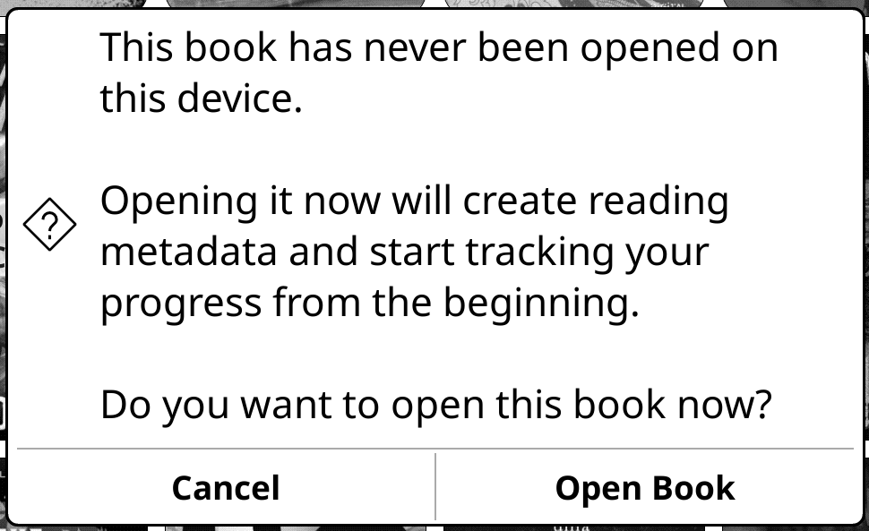
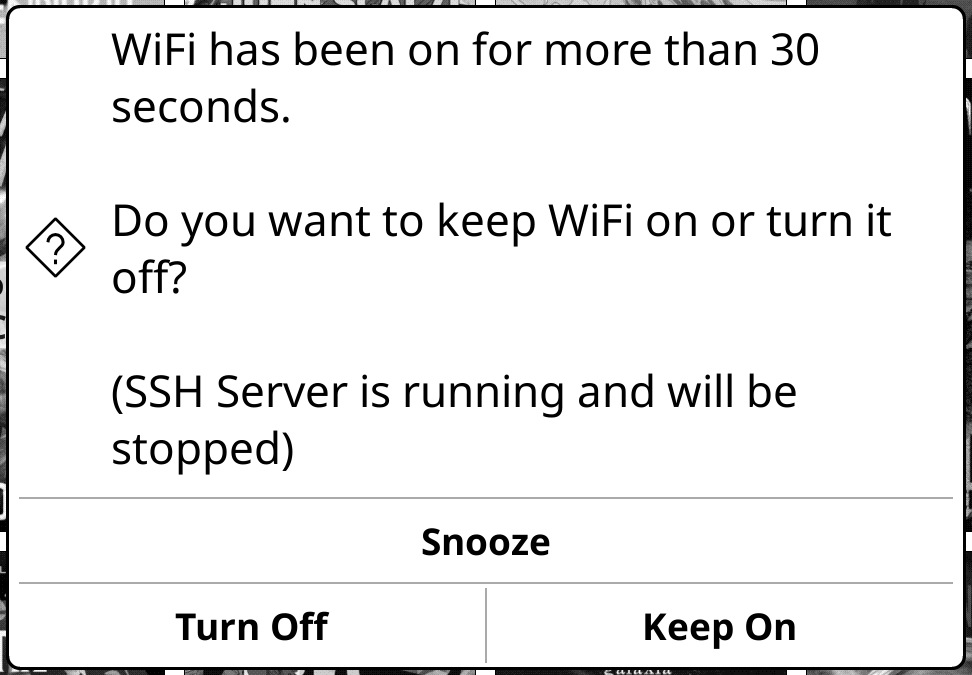
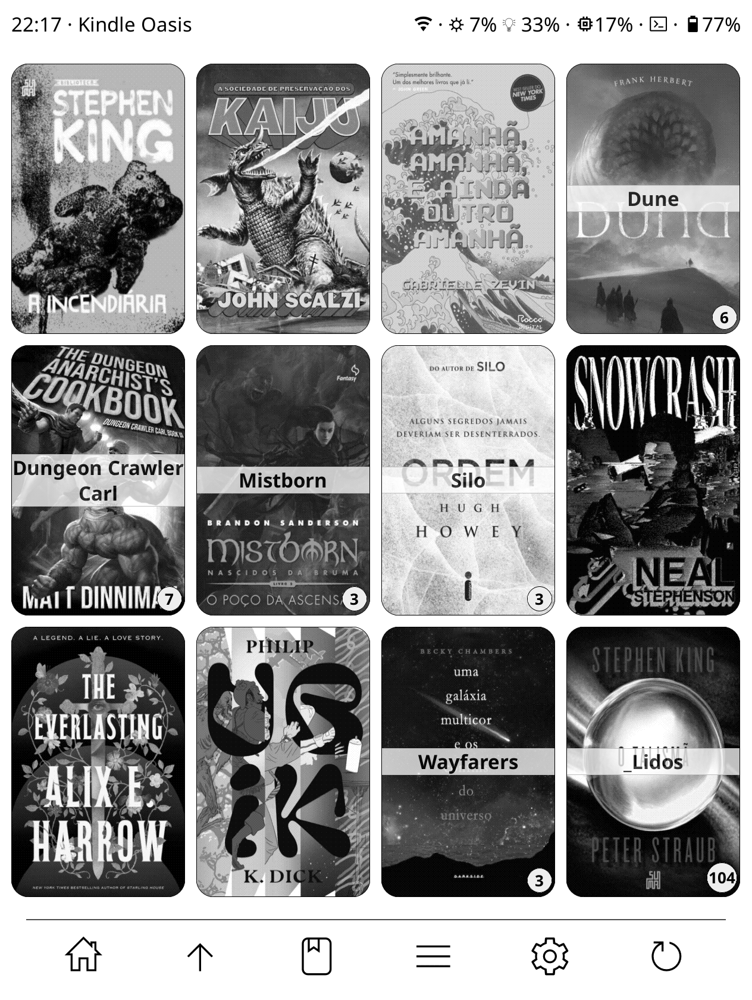

## KOReader Patches

**Personal patches for use with**
<sub>
[](https://github.com/koreader/koreader)
</sub>

### [🞂 confirm-first-open](2-confirm-first-open.lua)

Shows a confirmation dialog **before opening a book for the first time** on the device.



### [🞂 disable-wifi-off-notification](2-disable-wifi-off-notification.lua)

Blocks the "wi-fi off" notification from appearing in the UI by filtering popup messages.

### [🞂 kobo-style-screensaver](2-kobo-style-screensaver.lua)

Renders a custom screensaver displaying book information in Kobo-style layout, including title, chapter, progress, and book cover. Supports dark mode, customizable fonts, and random quote selection from highlights.

> **Based on:** [PedroMachado1/Koreader.patches](https://github.com/PedroMachado1/Koreader.patches/blob/main/2-kobo-style-screensaver.lua)  
> **Focus of modification:** Enhanced wallpaper selection mechanism with support for both directory and file paths.

### [🞂 expand-screensaver-info](2-expand-screensaver-info.lua)

Expands the available text variables for screensavers (and status bar) by injecting custom tokens. Features a caching mechanism that saves the last active book's statistics, allowing variables to display correctly even when the device is suspended from the file manager or main menu.

**Available Tokens**:
- $L: Time read today (e.g., "1h 30min").
- $H: Estimated time left to finish the book based on reading statistics.
- $C: Current chapter title.

### [🞂 pt-no-blank-foldercovers](2--pt-no-blank-foldercovers.lua)

Modifies the folder cover display in Mosaic/Grid view. If a folder contains fewer than 4 books, it removes the empty placeholders/gaps, displaying only the available covers.

> **Based on:** [tmfsd/KOReader-patches](https://github.com/tmfsd/KOReader-patches/blob/main/2-pt-no-blank-foldercovers.lua)  
> **Focus of modification:** Refactored internal function names to match standard KOReader naming conventions (e.g., `build_grid`).  
> **Compatibility Note:** This refactor allows the **Automatic Series Grouping** patch to hook into and inherit this "no-blank" behavior for virtual series folders. **Crucial:** This patch must load *before* the series patch (ensure alphabetical precedence).

### [🞂 wifi-auto-off-monitor](2-wifi-auto-off-monitor.lua)

Monitors WiFi and SSH server status, displaying a confirmation dialog after 30 seconds of continuous activity. Allows users to either keep them enabled, turn both off with a single action, or snooze the prompt for a configurable number of minutes. The dialog won't appear while the device is in screensaver mode, preventing unnecessary interruptions during sleep.



### [🞂 pt-hide-single-page-nav](2-pt-hide-single-page-nav.lua)

Hides the entire bottom navigation bar (<< < 1 > >>) in the file manager when a folder contains only one page of items.

### [🞂 pt-add-footer-icons](2-pt-add-footer-icons.lua)

Adds new info to the **Project Title** (CoverBrowser) plugin footer.

* **RAM:** Displays memory usage as a percentage.
* **SSH:** The icon only appears when the SSH server is running, hiding when turned off to save space.

**Requirement:** "Footer" > "Device Info" must be enabled in the Project Title settings.

### [🞂 title-navbar](2-title-navbar.lua)

Replaces the KOReader file browser title bar with a **custom status bar** and adds a **bottom navigation bar** with configurable action buttons.

> **Inspired by:** [u/doctorhetfield](https://www.reddit.com/user/doctorhetfield/) (initial concept)  
> **Code references:** [qewer33/koreader-patches](https://github.com/qewer33/koreader-patches) (pagination hiding approach and general patch architecture)



---

#### Bottom Navigation Bar

A fixed bar at the bottom of the file browser with up to 6 configurable buttons:

| Button | Action |
|--------|--------|
| `home` | Navigate to the home directory |
| `folder_up` | Go to the parent folder (blocked at home if `lock_home` is enabled) |
| `continue` | Open the last read book |
| `context_menu` | Open the folder context menu |
| `settings` | Open KOReader settings menu |
| `restart` | Flush settings and restart KOReader |

Each button can be individually enabled/disabled and given a custom label via the `buttons` table in `CFG`.

---

#### Status Bar (Titlebar)

A custom top bar that replaces the default KOReader title. The left side shows the time and optional contextual info; the right side shows device indicators.

**Left side modes** (`titlebar_left`):

- `"clock"` — time only
- `"info"` — time · device model (on home folder) or time · current folder name (elsewhere)

**Right side indicators** (each individually toggleable):

- WiFi status
- Frontlight and warmth, if the device supports it. On Android, requires a KOReader restart to update.
- RAM usage with configurable pattern
- SSH indicator, shown only while the server is running
- Battery

---

#### RAM Display Pattern

The RAM indicator uses a free-form pattern string with the following placeholders:

| Placeholder | Value |
|-------------|-------|
| `$k` | KOReader RAM usage (%) |
| `$K` | KOReader RAM usage (MB) |
| `$Kg` | KOReader RAM usage (GB, 2 decimal places) |
| `$u` | System RAM in use (%) |
| `$U` | System RAM in use (MB) |
| `$Ug` | System RAM in use (GB, 2 decimal places) |
| `$A` | Total device RAM (MB) |
| `$Ag` | Total device RAM (GB, 2 decimal places) |

Any literal text and symbols can be used freely between placeholders. Examples:

- `$k%`: `3%` *(default)*
- `$k% ($KMB)`: `3% (48MB)`
- `$k% ($KMB / $AgGB)`: `3% (48MB / 7.62GB)`

---

#### Icon Packs

Icons are loaded from `koreader/icons/tnb-icons/`. Each subfolder inside `tnb-icons/` is automatically detected as an icon pack and listed in the settings menu. If the folder does not exist or contains no subfolders, the icon pack option is disabled.

**Folder structure:**

```
koreader/
└── icons/
    └── tnb-icons/
        ├── HeroIcons/
        │   ├── home.svg
        │   ├── up.svg
        │   ├── last.svg
        │   ├── menu.svg
        │   ├── settings.svg
        │   └── restart.svg
        └── MyCustomPack/
            ├── home.svg
            └── ...
```

**Creating a new icon pack:** create a subfolder with any name inside `tnb-icons/` and place six SVG files inside it with these exact names: `home.svg`, `up.svg`, `last.svg`, `menu.svg`, `settings.svg`, `restart.svg`. The folder name will appear in the settings menu automatically after a restart.

---

#### Settings Menu

All options are accessible via **File Browser > ☰ > Settings > Navbar & Status bar**.

**Navbar bar:**

- **Display mode** *(restart required)* — `Icons only`, `Text only`, or `Icons + Text`
- **Show separator line** — thin line above the navbar, toggled live
- **Lock home** — prevents the Up button from navigating above the home directory
- **Icon pack** *(restart required)* — lists all packs found in `koreader/icons/tnb-icons/`; disabled if none found

**Show pagination** *(restart required)* — shows or hides the `<< < Page 1 of 2 > >>` footer

**Status bar:**

- **Show status bar** *(restart required)*
- **Left side** — `Clock` or `Info` mode, toggled live
- **Custom model name** — replaces the device model string shown in Info mode (input dialog, live)
- **Show border** — thin line below the status bar, toggled live
- **WiFi indicator** — toggled live
- **Frontlight indicator** — toggled live; warmth shown automatically if supported
- **RAM indicator** — toggled live
- **RAM pattern** — input dialog with placeholder reference
- **SSH indicator** — toggled live
- **Battery indicator** — toggled live
